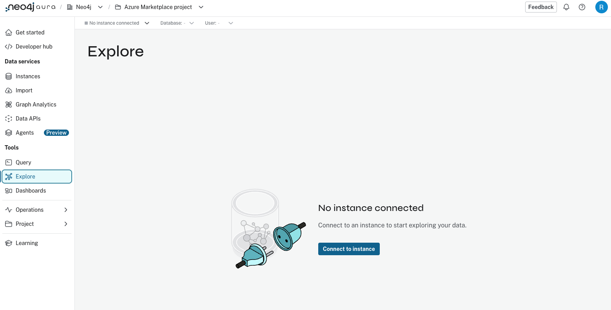
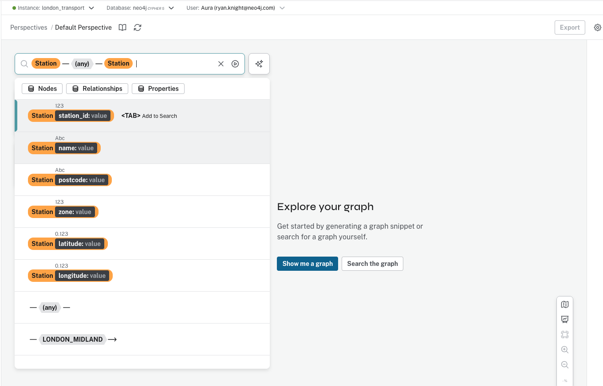
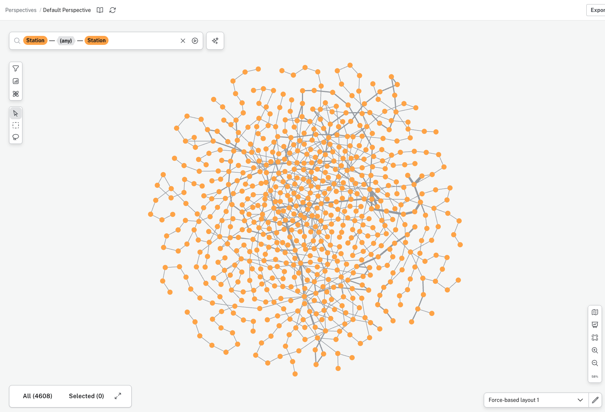

# Exploring the London Transport Data

After loading the data using `load_london_transport.ipynb`, you can visually explore the graph in Neo4j Aura.

## Step 1: Navigate to Aura Explore

1. Go to the **Neo4j Aura Console** (https://console.neo4j.io)
2. Click on your instance (e.g., `london_transport`)
3. In the left sidebar under **Tools**, click on **Explore**



If you see "No instance connected", click the **Connect to instance** button.

---

## Step 2: Connect to Your Instance

1. Click **Connect to instance**
2. Your instance should connect automatically (green indicator shows "Instance: london_transport")
3. You'll see the Explore interface with a search bar and options

---

## Step 3: Search for Stations

To visualize all stations and their tube line connections:

1. In the search bar at the top, construct the pattern:
   - Click **Station** (orange node)
   - Click the relationship connector `—(any)—`
   - Click **Station** (orange node)

This creates the pattern: `Station — (any) — Station`

2. You'll see the available properties for Station nodes:
   - `station_id: value`
   - `name: value`
   - `postcode: value`
   - `zone: value`
   - `latitude: value`
   - `longitude: value`

3. Click **Search the graph** (or press TAB and select it)



---

## Step 4: View the Graph

You should now see a beautiful visualization of the London Transport Network:

- **Orange nodes** = Station nodes
- **Colored edges** = Different tube lines (BAKERLOO, CENTRAL, CIRCLE, etc.)
- Each relationship type has a different color for easy identification



---

## Tips for Exploring

### Zoom and Pan
- **Zoom:** Scroll wheel or pinch gesture
- **Pan:** Click and drag the canvas
- **Center:** Double-click on empty space

### Inspect Nodes and Relationships
- **Click on a node** to see its properties
- **Click on a relationship** to see its type
- **Expand nodes** to see more connections

### Filter by Properties
You can filter stations by specific properties:
- **Zone:** `Station zone: value` — Enter a zone number (1, 2, 3, etc.)
- **Name:** `Station name: value` — Search for specific stations (e.g., "King's Cross")
- **Postcode:** `Station postcode: value` — Filter by postcode area

### Search by Tube Line
To see only specific tube lines, use the relationship filter:
1. Click the relationship selector `—(any)—`
2. Choose a specific line type:
   - `BAKERLOO`
   - `CENTRAL`
   - `CIRCLE`
   - `DISTRICT`
   - `HAMMERSMITH_AND_CITY`
   - `JUBILEE`
   - `METROPOLITAN`
   - `NORTHERN`
   - `PICCADILLY`
   - `VICTORIA`
   - `WATERLOO_AND_CITY`

Example: `Station — BAKERLOO → Station` shows only Bakerloo line connections

---

## Example Explorations

### Find Major Interchange Stations
Major interchanges will have many connections (multiple colored edges):
- Look for nodes with 6+ connections
- Examples: King's Cross St. Pancras, Oxford Circus, Bank

### Trace a Tube Line
1. Select a specific tube line relationship (e.g., `CENTRAL`)
2. Follow the path from end to end
3. See which stations it connects

### Find Stations by Zone
1. Use `Station zone: value` filter
2. Enter zone number (e.g., `1` for central London)
3. See all zone 1 stations

### Shortest Path Between Stations
1. Right-click on a station (e.g., "King's Cross St. Pancras")
2. Select "Find shortest path"
3. Right-click on another station (e.g., "Victoria")
4. View the shortest connection between them

---

## Perspectives

Neo4j Aura Explore uses **Perspectives** to customize your view:

- **Default Perspective:** Basic node and relationship display
- **Custom Perspectives:** Create your own color schemes and layouts
- **Export:** Save your perspective settings for future use

You can customize:
- Node colors by label or property
- Relationship colors by type
- Node size by property values
- Display captions (what property to show on nodes)

---

## Query Tab

For more advanced exploration, switch to the **Query** tab to run Cypher queries directly:

Example queries:
```cypher
// Count stations by zone
MATCH (s:Station)
RETURN s.zone as zone, count(s) as stations
ORDER BY zone

// Find busiest interchange stations
MATCH (s:Station)-[r]-()
RETURN s.name as station, count(r) as connections
ORDER BY connections DESC
LIMIT 10

// Shortest path between two stations
MATCH path = shortestPath(
  (from:Station {name: "King's Cross St. Pancras"})-[*]-(to:Station {name: "Victoria"})
)
RETURN path
```

---

## Next Steps

- **Try the Text-to-Cypher Agent:** Use `notebooks/query_london_transport.ipynb` to ask questions in natural language
- **Build Dashboards:** Create custom visualizations in the Dashboards section
- **Learn Cypher:** Explore the Developer hub for Cypher query tutorials

Enjoy exploring the London Transport Network! 🚇
