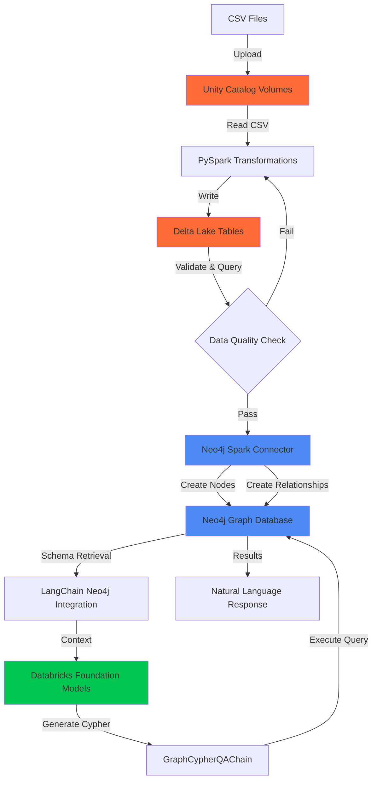

# From Raw Data to Intelligent Knowledge Graphs with Natural Language Queries

## Introduction

Modern data platforms can work together to create accessible, powerful analytics systems from raw data files. This blog explores building a complete pipeline using Databricks lakehouse architecture and Neo4j graph database, with a natural language query interface that makes graph analytics accessible to all users.

Using London's public transport network with 302 stations, we transform CSV files into a knowledge graph answering questions like "Which stations should I avoid during rush hour?" or "Find the shortest path between King's Cross and Victoria." These architecture patterns scale to enterprise knowledge graphs spanning millions of entities across any domain where relationships drive insights.

## Architecture Overview: The Complete Data Flow

The architecture flows through four integrated stages, leveraging the strengths of both Databricks and Neo4j while maintaining a clean separation of concerns.

### Stage One: Unity Catalog for Governed Data Landing

Raw CSV files land in Databricks Unity Catalog volumes, establishing governance from the outset. Unity Catalog provides enterprise-grade governance with fine-grained access controls, automatic lineage tracking, and centralized metadata management. Unlike traditional blob storage, Unity Catalog treats volumes as first-class data assets with full audit trails and security integration.

For the London Transport Network, two CSV files capture the domain: stations with attributes and tube line connections. Unity Catalog volumes provide the secure landing zone where these files become queryable assets within the lakehouse architecture.

The governance capabilities matter for production deployments. Data engineers can grant access without exposing storage credentials. Audit logs track every access. Tags and metadata enable discovery, making datasets findable across the organization.

### Stage Two: Delta Lake for ACID Compliance and Validation

PySpark reads CSV files from Unity Catalog volumes and writes transformed data to Delta Lake tables, establishing a validation checkpoint before graph construction. Delta Lake extends Apache Parquet with ACID transactions, schema enforcement, time travel, and efficient upserts.

ACID transactions prevent partial writes from corrupting tables. Schema enforcement validates incoming data against declared types and constraints, catching quality issues immediately. Time travel enables querying historical table versions for debugging or analysis.

The PySpark transformation layer performs essential data preparation. Column renaming maps source fields to semantic property names. Type casting ensures numeric operations work correctly. Null handling strategies manage missing values. Deduplication logic prevents duplicate nodes in the graph.

This checkpoint enables validation before committing data to Neo4j. Analysts can query tables with SQL, verifying row counts, checking distributions, and confirming transformations. For the transport network, validation confirms all 302 stations loaded correctly with expected values.

### Stage Three: Neo4j Spark Connector for Efficient Graph Loading

The Neo4j Spark Connector bridges the lakehouse and graph database, efficiently translating DataFrames into graph structures. This connector is purpose-built for bulk loading, handling complexities of node creation, relationship formation, and graph optimization automatically.

#### Connector Architecture and Capabilities

The Neo4j Spark Connector operates as a Spark data source, integrating natively with the execution engine. When writing DataFrames, the connector partitions data across executors for parallel processing. Each executor establishes its own connection, enabling concurrent writes that scale with cluster resources. This parallelization makes loading millions of nodes feasible in minutes.

The connector handles batching automatically, grouping operations to minimize network round trips while respecting transaction limits. Batch sizes adapt to payload characteristics. Configurable parameters allow tuning for specific deployments.

Error handling ensures reliability. The connector detects transient failures and retries operations with exponential backoff. Permanent failures are logged with detailed context for investigation.

#### Node Creation Configuration

Creating Station nodes demonstrates the connector's capabilities. The DataFrame contains station attributes that configuration options translate into graph nodes.

The labels option defines node categories. For stations, the label "Station" enables queries like "MATCH (s:Station)" to retrieve all station nodes. Multiple labels can be assigned where entities have multiple classifications.

The node keys option specifies unique identifiers. Setting station_id as the node key ensures rerunning the load updates existing nodes rather than creating duplicates. The connector generates MERGE operations, making loads idempotent.

Property mapping happens automatically based on DataFrame columns but can be customized. The connector translates Spark data types to appropriate Neo4j property types.

Index creation completes node loading. Indexes on station_id and name enable fast lookups during relationship creation and efficient queries.

#### Relationship Creation Configuration

Relationship creation requires matching source and target nodes, specifying relationship types, and optionally setting properties.

The relationship option defines the relationship type. For the transport network, line-specific types like BAKERLOO, CENTRAL, and CIRCLE leverage Neo4j's relationship type indexing for query performance.

Source node specifications tell the connector how to match nodes. The relationship source labels option specifies source node labels, while relationship source node keys maps DataFrame columns to node properties. For tube connections, the from_station column matches against the Station node's name property.

Target node specifications mirror source configuration. The relationship target labels and relationship target node keys options perform matching logic for endpoints.

The relationship save strategy option controls handling of existing relationships. The "keys" strategy creates relationships based on node key matches.

Bidirectional relationship creation requires two write operations. The transport network creates relationships in both directions since tube connections work both ways. This bidirectionality simplifies Cypher queries that traverse relationships.

#### Performance Characteristics

The connector's performance scales with Spark cluster resources. Node creation scales nearly linearly with parallelism since each executor writes independent nodes without contention.

Relationship creation does not scale linearly due to Neo4j's locking requirements. Neo4j must lock both source and target nodes to maintain consistency. If multiple executors attempt to create relationships on the same nodes simultaneously, lock contention occurs and executors must wait.

The degree of contention depends on graph structure. Graphs where relationships touch many different nodes experience less contention and better scaling. Graphs where relationships concentrate on hub nodes experience more contention. For the transport network, major interchange stations become contention points when loading relationships from multiple tube lines simultaneously.

This locking behavior is fundamental to Neo4j's consistency guarantees. Strategies to mitigate contention include ordering relationship creation to reduce simultaneous access or batching relationships by node.

For the transport network's 302 stations and several thousand relationships, loading completes in seconds. Enterprise graphs with millions of nodes and billions of relationships load in minutes to hours depending on cluster size, relationship complexity, and lock contention.

Write throughput depends on network bandwidth, Neo4j instance specifications, relationship complexity, indexes, and node lock contention. The connector provides detailed metrics through Spark's monitoring interface for performance tuning.

### Stage Four: Natural Language Query Interface with Databricks Foundation Models

With the graph constructed, the natural language query layer makes graph analytics accessible without requiring Cypher expertise. This layer combines schema-aware prompt engineering with Databricks Foundation Models to generate accurate Cypher queries.

#### LangChain Neo4j Integration

The LangChain Neo4j integration provides the foundation. This library connects to Neo4j, retrieves the graph schema automatically, and manages query execution. Schema retrieval discovers node labels, relationship types, and property names for Cypher generation context.

The retrieved schema documents the graph structure: Station nodes with properties and relationship types for each tube line. This schema becomes part of the prompt context sent to the language model.

#### Databricks Foundation Models for Cypher Generation

Databricks Foundation Models provide enterprise-grade LLM access through managed endpoints. These endpoints handle model serving, auto-scaling, monitoring, and version management. The architecture uses Claude Sonnet 4.5, selected for its strong code generation and reasoning capabilities.

Model configuration uses temperature zero to maximize deterministic behavior. The same question generates the same Cypher query consistently, ensuring reliable application behavior.

The prompt template provides comprehensive instructions and context. It begins with task definition: generate valid Cypher queries. The graph schema follows, showing nodes, properties, and relationships. Domain-specific guidance helps the model understand the transport context.

Modern Cypher syntax guidelines steer the model toward Neo4j 5.x best practices. The prompt encourages COUNT subquery syntax, which provides clearer semantics and better performance. Case-insensitive matching handles variations in how users refer to stations. Bidirectional traversal guidance accounts for symmetric transport connections.

#### Query Execution and Results

The GraphCypherQAChain orchestrates the flow from question to answer. It receives the natural language question, combines it with the prompt template and schema context, invokes the Foundation Model to generate Cypher, executes the query against Neo4j, and formats results.

Verbose logging displays generated Cypher alongside results, providing transparency. Users see both answers and the queries that produced them, building trust and enabling learning.

Query execution happens directly against Neo4j with full index utilization. Generated Cypher leverages relationship type indexes, property indexes, and optimized traversal algorithms. Performance characteristics match hand-written Cypher.

## The Power of Graph-Native Modeling

Using line-specific relationship types rather than generic relationships with properties demonstrates Neo4j best practices and significantly impacts system capabilities.

### Performance Through Type-Based Indexing

Neo4j indexes relationship types automatically, making type-based filtering extremely fast. A query for Bakerloo line connections executes in milliseconds by leveraging the relationship type index, even on large graphs. Property-based filtering requires scanning relationships and checking values, which is orders of magnitude slower.

This performance difference matters for real-time applications. Mobile apps helping commuters navigate need subsecond response times. Type-based relationship modeling ensures these requirements remain achievable as graphs grow.

### Semantic Clarity and Schema Evolution

Typed relationships make the graph schema self-documenting. Examining relationship types immediately reveals what connections exist. For the transport network, BAKERLOO, CENTRAL, and CIRCLE types clearly indicate which tube lines exist.

Schema evolution becomes trivial. When a new Elizabeth line opens, the loading process creates ELIZABETH relationships without schema modifications or application code changes. The graph naturally accommodates new relationship types.

### Advanced Analytics with Neo4j Graph Data Science

Neo4j Graph Data Science algorithms leverage typed relationships for sophisticated analysis. Community detection can analyze each tube line separately, identifying station clusters. Centrality algorithms can weight different line types differently.

Link prediction algorithms work more effectively with typed relationships. The algorithm learns connection patterns based on line types. Path-finding algorithms can include or exclude specific relationship types, enabling queries like "find routes avoiding the Central line."

## Natural Language Queries: Expanding Access Across Teams

The text-to-Cypher interface expands who can work effectively with graph data, complementing Cypher with a natural language alternative.

Developers benefit from faster prototyping and exploration. Quickly testing queries without referencing documentation accelerates iteration. Data analysts can flow seamlessly between SQL and graph traversals using natural language. Domain experts can validate data quality using their domain terminology rather than database syntax.

This expanded accessibility multiplies insight discovery. When users across the organization can query the graph in ways that fit their workflows, the patterns identified and questions answered scale dramatically.

## Enterprise Extensions

The pattern demonstrated with the transport network extends to enterprise knowledge graphs across domains.

### Customer Intelligence Graphs

Customer knowledge graphs connect customers, accounts, products, transactions, and interactions. Natural language queries enable questions like "Which healthcare customers purchased but have not renewed?" The ETL pattern remains consistent while domain-specific prompt engineering adapts the language model to customer intelligence terminology.

### Multi-Modal Enrichment

Production implementations often enrich graphs with unstructured data. LLMs analyzing customer profiles or product descriptions can extract entities and relationships that structured ETL processes miss. These enhancements flow back through the connector, creating a feedback loop where the graph continuously evolves.

### Real-Time Integration

While batch loading suits reference data, operational data requires streaming integration. Neo4j supports ingestion from Kafka, Databricks Delta Live Tables, and change data capture systems. Hybrid architectures use batch ETL for reference data and streaming for operational events.

## Conclusion: The Lakehouse-Graph Convergence

This architecture demonstrates the convergence of lakehouse platforms and graph databases, each providing capabilities the other lacks. Databricks excels at data governance and transformation at scale. Neo4j excels at relationship-centric modeling and millisecond-latency traversals. The Neo4j Spark Connector bridges these platforms efficiently, while Databricks Foundation Models provide the natural language interface.

Raw CSV files transform into semantically rich knowledge graphs that capture entities and meaningful connections. Natural language queries make graph analytics accessible to anyone who can formulate questions. The patterns demonstrated here with 302 stations scale to enterprise graphs with millions of entities and billions of relationships.

Building intelligent knowledge graphs no longer requires exotic expertise or extended timelines. Organizations can implement these architectures in weeks. Starting with clear use cases and thoughtful graph modeling creates systems that deliver immediate value while establishing patterns that scale to broader knowledge graph initiatives.
