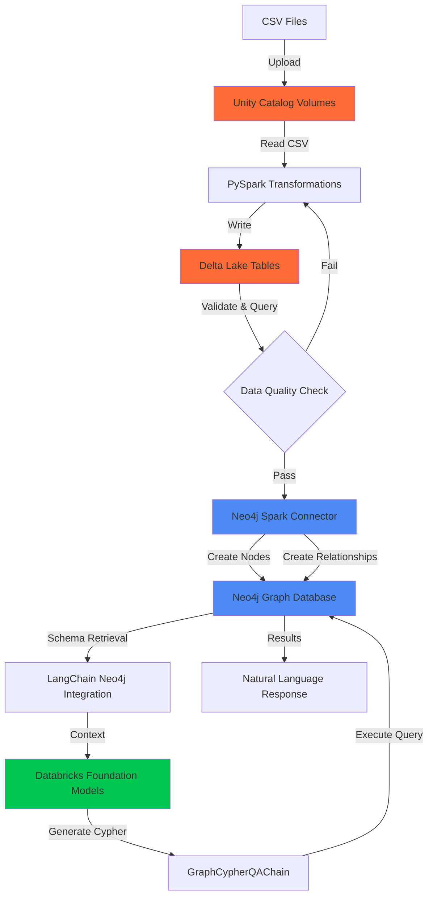

# From Raw Data to Intelligent Knowledge Graphs with Natural Language Queries

## Introduction

The journey from raw data files to an intelligent, conversational knowledge graph demonstrates how modern data platforms can work together to create accessible, powerful analytics systems. This blog explores building a complete pipeline using Databricks lakehouse architecture and Neo4j graph database, culminating in a natural language query interface that makes graph analytics accessible to developers, analysts, and business users alike.

Using London's public transport network with 302 stations and multiple tube lines as our example, we transform simple CSV files into a sophisticated knowledge graph capable of answering questions like "Which stations should I avoid during rush hour?" or "Find the shortest path between King's Cross and Victoria." The architecture patterns demonstrated here scale to enterprise knowledge graphs spanning millions of entities across any domain where relationships drive insights.

## Architecture Overview: The Complete Data Flow

The architecture flows through four integrated stages, leveraging the strengths of both Databricks and Neo4j while maintaining a clean separation of concerns.

### Stage One: Unity Catalog for Governed Data Landing

Raw CSV files land in Databricks Unity Catalog volumes, a critical first step that establishes governance from the outset. Unity Catalog provides enterprise-grade data governance with fine-grained access controls, automatic lineage tracking, and centralized metadata management across the lakehouse. Unlike traditional blob storage, Unity Catalog treats volumes as first-class data assets with full audit trails, tagging capabilities, and integration with the broader Databricks security model.

For the London Transport Network, two CSV files capture the domain: stations with their attributes (identifier, name, coordinates, zone, postcode) and tube line connections specifying source stations, destination stations, and line names. Unity Catalog volumes provide the secure, governed landing zone where these files become queryable assets within the lakehouse architecture.

The governance capabilities matter particularly for production deployments. Data engineers can grant read access to specific volumes without exposing underlying cloud storage credentials. Audit logs track every access to the raw data. Tags and metadata enable discovery through the Unity Catalog explorer, making datasets findable by teams across the organization.

### Stage Two: Delta Lake for ACID Compliance and Validation

PySpark reads CSV files from Unity Catalog volumes and writes transformed data to Delta Lake tables, establishing a validation checkpoint before graph construction. Delta Lake extends Apache Parquet with critical capabilities that standard data lakes lack: ACID transaction guarantees, schema enforcement, time travel, and efficient upserts.

ACID transactions ensure that partial writes never corrupt tables. If a transformation job fails midway, Delta Lake rolls back the incomplete write, maintaining table consistency. Schema enforcement validates that incoming data matches declared types and constraints, catching data quality issues immediately rather than propagating bad data downstream. Time travel capabilities enable querying historical versions of tables, crucial for debugging transformation logic or understanding how data evolved.

The PySpark transformation layer performs essential data preparation. Column renaming maps source field names to semantic property names that will become graph properties. Type casting converts string coordinates to doubles, ensuring numeric operations in Neo4j work correctly. Null handling strategies decide whether missing values should be omitted, use defaults, or flag rows for review. Deduplication logic ensures each station appears once, preventing duplicate nodes in the graph.

This Delta Lake checkpoint enables validation before committing data to Neo4j. Analysts can query tables with familiar SQL, verifying row counts, checking distributions, and confirming transformations applied correctly. For the transport network, validation queries confirm that all 302 stations loaded, that zones contain expected values, that coordinate ranges fall within London's boundaries, and that tube line names match expected values.

### Stage Three: Neo4j Spark Connector for Efficient Graph Loading

The Neo4j Spark Connector bridges the lakehouse and graph database, efficiently translating DataFrames into graph structures. This connector is purpose-built for bulk loading, handling complexities of node creation, relationship formation, and graph optimization automatically.

#### Connector Architecture and Capabilities

The Neo4j Spark Connector operates as a Spark data source, integrating natively with the Spark execution engine. When writing DataFrames to Neo4j, the connector partitions data across Spark executors for parallel processing. Each executor establishes its own Neo4j connection, enabling concurrent writes that scale linearly with cluster resources. This parallelization makes loading millions of nodes or relationships feasible in minutes rather than hours.

The connector handles batching automatically, grouping operations to minimize network round trips while respecting Neo4j's transaction size limits. Batch sizes adapt to payload characteristics: smaller batches for complex relationship patterns, larger batches for simple node creation. Configurable batch size parameters allow tuning for specific deployment characteristics and network conditions.

Error handling and retry logic ensure reliability. The connector detects transient failures (network timeouts, temporary database unavailability) and automatically retries operations with exponential backoff. Permanent failures (constraint violations, schema errors) are logged with detailed context, enabling investigation without silently dropping data.

#### Node Creation Configuration

Creating Station nodes demonstrates the connector's node loading capabilities. The DataFrame contains station attributes: identifier, name, coordinates, zone, postcode. Configuration options specify how this tabular data becomes graph nodes.

The labels option defines node labels, the categories that classify nodes in Neo4j. For stations, the label "Station" enables queries like "MATCH (s:Station)" to retrieve all station nodes. Multiple labels can be assigned, useful for domains where entities have multiple classifications.

The node keys option specifies which properties uniquely identify nodes. Setting station_id as the node key ensures that if the load runs multiple times, it updates existing nodes rather than creating duplicates. The connector generates MERGE operations rather than CREATE operations, making loads idempotent and enabling incremental updates.

Property mapping happens automatically based on DataFrame column names, but can be customized through configuration. The connector respects Spark data types, translating integers, doubles, strings, booleans, and timestamps to appropriate Neo4j property types.

Index creation completes node loading. While indexes can be created through Cypher, the connector can also create indexes during the load process. For the transport network, indexes on station_id and name enable fast lookups during relationship creation and efficient query execution.

#### Relationship Creation Configuration

Relationship creation showcases the connector's most sophisticated capabilities, as relationships require matching source and target nodes, specifying relationship types, and optionally setting properties.

The relationship option defines the relationship type. For the transport network, the critical design decision uses line-specific types: BAKERLOO, CENTRAL, CIRCLE. This leverages Neo4j's relationship type indexing for query performance.

Source and target node specifications tell the connector how to match nodes. The relationship source labels option specifies source node labels (Station), while relationship source node keys maps DataFrame columns to node properties for matching. For tube line connections, the DataFrame's from_station column matches against the Station node's name property.

Target node specifications mirror source configuration, defining how to locate destination nodes. The relationship target labels and relationship target node keys options perform the same matching logic for the relationship's endpoint.

The relationship save strategy option controls how the connector handles existing relationships. The "keys" strategy creates relationships based on node key matches, useful for bulk loading scenarios. Alternative strategies support more complex update patterns for incremental loads.

Bidirectional relationship creation requires two write operations. The transport network creates relationships in both directions since tube connections work both ways. The connector processes each direction independently, first creating relationships from station A to station B, then from B to A. This bidirectionality simplifies Cypher queries, which can traverse relationships in either direction without checking relationship direction.

#### Performance Characteristics

The connector's performance scales with Spark cluster resources, though with important caveats. Node creation scales nearly linearly with parallelism. A cluster with 8 executors can create nodes approximately 8x faster than a single connection, since each executor writes independent nodes without contention.

Relationship creation, however, does not scale linearly due to Neo4j's locking requirements. When creating a relationship, Neo4j must lock both the source and target nodes to maintain consistency and prevent race conditions. If multiple executors attempt to create relationships on the same nodes simultaneously, lock contention occurs. The executors must wait for locks to be released, reducing effective parallelism.

The degree of contention depends on graph structure and loading patterns. Graphs where relationship creation touches many different nodes (low degree, distributed connections) experience less contention and better scaling. Graphs where relationship creation concentrates on hub nodes (high degree, centralized connections) experience more contention and reduced scaling. For the transport network, major interchange stations like King's Cross or Oxford Circus become contention points when loading relationships from multiple tube lines simultaneously.

This locking behavior is fundamental to Neo4j's consistency guarantees, not a connector limitation. Strategies to mitigate contention include ordering relationship creation to reduce simultaneous access to the same nodes, batching relationships by node to group operations, or accepting that relationship loading throughput plateaus as parallelism increases beyond a certain point.

For the transport network's 302 stations and several thousand relationships, loading completes in seconds despite this contention. Enterprise graphs with millions of nodes and billions of relationships load in minutes to hours depending on cluster size, relationship complexity, graph topology, and the degree of lock contention encountered.

Write throughput depends on several factors: network bandwidth between Spark and Neo4j, Neo4j instance specifications (CPU, memory, disk), relationship complexity (simple edges versus complex patterns), whether indexes exist for relationship endpoint matching, and critically, the degree of node lock contention based on graph structure. The connector provides detailed metrics through Spark's monitoring interface, enabling performance tuning and identification of contention hotspots.

### Stage Four: Natural Language Query Interface with Databricks Foundation Models

With the graph constructed, the natural language query layer makes graph analytics accessible without requiring Cypher expertise. This layer combines schema-aware prompt engineering with Databricks Foundation Models to generate accurate Cypher queries from natural language questions.

#### LangChain Neo4j Integration

The LangChain Neo4j integration provides the foundation for the query interface. This library connects to Neo4j, retrieves the graph schema automatically, and manages query execution. Schema retrieval discovers node labels, relationship types, and property names, providing crucial context for Cypher generation.

The retrieved schema documents the graph structure: Station nodes with properties (station_id, name, latitude, longitude, zone, postcode), and relationship types for each tube line (BAKERLOO, CENTRAL, CIRCLE, DISTRICT, and so on). This schema becomes part of the prompt context sent to the language model.

#### Databricks Foundation Models for Cypher Generation

Databricks Foundation Models provide enterprise-grade LLM access through managed endpoints. These endpoints handle model serving, auto-scaling, monitoring, and version management, eliminating infrastructure concerns. The architecture uses Claude Sonnet 4.5 through a Databricks Foundation Model endpoint, selected for its strong code generation and logical reasoning capabilities.

Model configuration uses temperature zero to maximize deterministic behavior. The same question generates the same Cypher query consistently, ensuring reliable application behavior. This consistency matters for production systems where users expect repeatable results.

The prompt template provides comprehensive instructions and context. It begins with task definition: generate valid Cypher queries for a graph database. The graph schema follows, showing exactly what nodes, properties, and relationships exist. Domain-specific guidance helps the model understand the transport context: stations have zones, lines connect stations, paths exist through relationship traversals.

Modern Cypher syntax guidelines steer the model toward Neo4j 5.x best practices. The prompt explicitly encourages COUNT subquery syntax, which provides clearer semantics and better performance than older OPTIONAL MATCH patterns. Case-insensitive matching instructions handle variations in how users refer to stations. Bidirectional traversal guidance accounts for the symmetric nature of transport connections.

#### Query Execution and Results

The GraphCypherQAChain orchestrates the complete flow from question to answer. It receives the user's natural language question, combines it with the prompt template and schema context, invokes the Databricks Foundation Model to generate Cypher, executes the generated query against Neo4j, and formats results for display.

Verbose logging displays generated Cypher alongside results, providing transparency about system interpretation. Users see not just answers but also the queries that produced them, building trust and enabling learning.

Query execution happens directly against Neo4j with full index utilization. The generated Cypher leverages relationship type indexes for line-specific queries, property indexes for name lookups, and Neo4j's optimized graph traversal algorithms for path finding. Performance characteristics match hand-written Cypher.

## The Power of Graph-Native Modeling

The architectural decision to use line-specific relationship types rather than generic relationships with properties demonstrates Neo4j best practices and significantly impacts system capabilities.

### Performance Through Type-Based Indexing

Neo4j indexes relationship types automatically, making type-based filtering extremely fast. A query for all Bakerloo line connections executes in milliseconds by leveraging the relationship type index, even on graphs with millions of relationships. Property-based filtering requires scanning relationships and checking property values, orders of magnitude slower for large graphs.

This performance difference matters for real-time applications. Mobile apps helping commuters navigate need subsecond response times. Customer service systems assisting with route planning cannot tolerate multi-second queries. Type-based relationship modeling ensures these requirements remain achievable as graphs grow.

### Semantic Clarity and Schema Evolution

Typed relationships make the graph schema self-documenting. Examining relationship types immediately reveals what connections exist in the domain. For the transport network, the presence of BAKERLOO, CENTRAL, CIRCLE types clearly indicates which tube lines the graph represents.

Schema evolution becomes trivial. When a new Elizabeth line opens, the loading process creates ELIZABETH relationships without schema modifications, data migrations, or application code changes. The graph naturally accommodates new relationship types, contrasting with property-based designs that require updating documentation and application logic when new property values appear.

### Advanced Analytics with Neo4j Graph Data Science

Neo4j Graph Data Science algorithms leverage typed relationships for sophisticated analysis. Community detection can analyze each tube line separately, identifying clusters of stations that form natural service zones. Centrality algorithms can weight different line types differently, recognizing that certain lines might be more important for determining station significance.

Link prediction algorithms work more effectively with typed relationships. The algorithm learns that if two stations both connect to a third via the same line type, they might eventually connect directly on that line. Path-finding algorithms can include or exclude specific relationship types, enabling queries like "find routes avoiding the Central line."

## Natural Language Queries: Expanding Access Across Teams

The text-to-Cypher interface expands who can work effectively with graph data, complementing Cypher with a natural language alternative optimized for different workflows.

Developers benefit from faster prototyping and exploration. During feature development, quickly testing queries without referencing Cypher documentation accelerates iteration. Data analysts can flow seamlessly between SQL-based lakehouse queries and graph traversals using natural language for both. Domain experts can validate data quality and explore patterns using terminology from their domain rather than database syntax.

This expanded accessibility multiplies insight discovery. When analysts, developers, and business users across the organization can query the graph in ways that fit their workflows, the patterns identified and questions answered scale dramatically.

## Enterprise Extensions

The pattern demonstrated with the transport network extends to enterprise knowledge graphs across domains.

### Customer Intelligence Graphs

Customer knowledge graphs connect customers, accounts, products, transactions, and interactions. Natural language queries enable questions like "Which healthcare customers purchased but have not renewed?" or "Find customers with similar buying patterns to high-value accounts." The ETL pattern (CRM systems to lakehouse to graph) remains consistent while domain-specific prompt engineering adapts the language model to customer intelligence terminology.

### Multi-Modal Enrichment

Production implementations often enrich graphs with unstructured data. LLMs analyzing customer profiles, product descriptions, or market research documents can extract entities and relationships that structured ETL processes miss. These proposed enhancements flow back through the connector to Neo4j, creating a feedback loop where the graph continuously evolves as new information sources are processed.

### Real-Time Integration

While batch loading suits reference data, operational data requires streaming integration. Neo4j supports ingestion from Kafka, Databricks Delta Live Tables, and change data capture systems. Hybrid architectures use batch ETL for reference data and streaming for operational events, enabling queries that combine static structure with real-time state.

## Conclusion: The Lakehouse-Graph Convergence

This architecture demonstrates the convergence of lakehouse platforms and graph databases, each providing capabilities the other lacks. Databricks excels at data governance, transformation at scale, and integration with diverse data sources. Neo4j excels at relationship-centric modeling, graph algorithms, and millisecond-latency traversals. The Neo4j Spark Connector bridges these platforms efficiently, while Databricks Foundation Models provide the natural language interface.

Raw CSV files transform into semantically rich knowledge graphs that capture not just entities but the meaningful connections between them. Natural language queries make graph analytics accessible to anyone who can formulate questions. The patterns demonstrated here with 302 stations scale to enterprise graphs with millions of entities and billions of relationships.

Building intelligent knowledge graphs no longer requires exotic expertise or extended timelines. The tools, frameworks, and patterns have matured to the point where organizations can implement these architectures in weeks. Starting with clear use cases, thoughtful graph modeling, and iterative refinement creates systems that deliver immediate value while establishing patterns that scale to broader knowledge graph initiatives across the enterprise.
