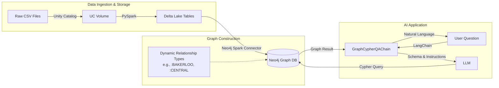

# From Raw Data to Intelligent Knowledge Graphs with Natural Language Queries

## Introduction

The journey from raw data to an intelligent, conversational knowledge graph represents a shift from rigid, pre-defined dashboards to flexible, natural language interrogation. This post details the engineering implementation of a system that combines the **Databricks Lakehouse** architecture with **Neo4j's** graph capabilities, culminating in a text-to-Cypher interface powered by **LangChain** and Large Language Models (LLMs).

Using London's public transport network as our dataset, we will examine the code required to transform CSV files into a sophisticated knowledge graph and build a reliable agent capable of answering questions like "Find the shortest path between King's Cross and Victoria."

## Architecture Overview

The pipeline follows a linear flow: data ingestion via Databricks, graph construction via the Neo4j Spark Connector, and query processing via a LangChain agent.



## Stage One: The Foundation - Databricks Lakehouse & Unity Catalog

Before we can build a graph, we need a robust data foundation. We utilize the **Databricks Lakehouse** architecture, which unifies the flexibility of data lakes with the reliability of data warehouses.

Central to this is **Unity Catalog**, which provides a unified governance layer for all data and AI assets. In our pipeline, we don't just read files; we ingest them into **Delta Lake** tables. Delta Lake brings ACID transactions to Spark, ensuring that our data is reliable, versioned, and validated before it ever reaches the graph.

Why is this intermediate step critical?
1.  **Schema Enforcement:** We ensure that coordinates are doubles and IDs are integers using PySpark's schema validation.
2.  **Data Lineage:** Unity Catalog tracks exactly where the data came from and how it was transformed, providing the audit trail necessary for enterprise applications.
3.  **Performance:** Delta tables are optimized for fast reads, which accelerates the subsequent write-to-graph phase.

```python
# From notebooks/load_london_transport.ipynb
# Validating and writing stations to a managed Delta table
stations_clean.write.format("delta").mode("overwrite").saveAsTable(STATIONS_TABLE)
```

## Stage Two: High-Scale Ingestion with the Neo4j Spark Connector

Moving data from a relational/tabular format (Spark DataFrames) to a graph structure (Nodes and Relationships) requires efficient translation. We use the **Neo4j Spark Connector**, a specialized tool designed for high-throughput data movement.

### How it Works
The connector leverages Spark's distributed nature. It partitions the DataFrame and executes writes in parallel across the cluster's executors. It handles the complexity of the **Cypher Bolt** protocol, managing transaction batches and retries automatically. This allows us to load millions of nodes and relationships in minutes rather than hours.

### Dynamic Graph Modeling: Data as Schema
A critical design choice in this project is how we model transit lines. Instead of a generic `:CONNECTED_TO` relationship with a property `{line: "Bakerloo"}`, we create specific relationship types for each line, such as `:BAKERLOO` or `:VICTORIA`.

**Why?**
*   **Performance:** Neo4j indexes relationship types. Querying `MATCH ()-[:BAKERLOO]-()` is significantly faster than scanning generic relationships and filtering on a string property.
*   **Semantics:** The graph schema itself describes the network topology, making it easier for both humans and LLMs to understand.

### The Code Implementation
We achieve this dynamically in PySpark. We loop through the distinct lines in our data, defining the relationship type variable (`rel_type`) on the fly.

Crucially, we use the `.option("relationship.save.strategy", "keys")` configuration. This tells the connector to perform a **MERGE** operation based on the node keys (station names) rather than a CREATE operation. This guarantees **idempotency**—we can run the pipeline multiple times without creating duplicate connections.

```python
# From notebooks/load_london_transport.ipynb
# Writing dynamic relationship types (e.g., :BAKERLOO)
(
    line_data.write
    .format("org.neo4j.spark.DataSource")
    .mode("Append")
    .option("relationship", rel_type)             # Dynamic Type: BAKERLOO
    .option("relationship.save.strategy", "keys") # Idempotent Merge
    .option("relationship.source.labels", ":Station")
    .option("relationship.source.node.keys", "from_station:name")
    .option("relationship.target.labels", ":Station")
    .option("relationship.target.node.keys", "to_station:name")
    .save()
)
```

## Stage Three: The Natural Language Agent

With the graph built, we create an agent to query it. We use **LangChain's** `GraphCypherQAChain`. This component takes a user's natural language question, uses an LLM to translate it into a Cypher query, executes that query against Neo4j, and uses the LLM again to summarize the results.

### Prompt Engineering for Reliability
The biggest challenge with Text-to-Cypher is **hallucination**—the LLM generating invalid syntax or assuming schema elements that don't exist. To combat this, we don't just rely on the LLM's training; we provide a strict `PromptTemplate` that enforces rules specific to our graph structure.

In our `agents/query_neo4j.py`, we explicitly instruct the model on:
1.  **Case Insensitivity:** Users write "kings cross", database has "King's Cross". We force `toLower()` comparisons.
2.  **Modern Syntax:** We enforce the use of `COUNT{}` subqueries (Neo4j 5.x syntax) for better performance and cleaner code.
3.  **Schema Awareness:** We remind the model that tube lines are *relationship types*, not properties.

```python
# From agents/query_neo4j.py
cypher_template = """Task: Generate Cypher statement to query the London Transport Network...
Instructions:
- Use only the provided relationship types...
- Use `WHERE toLower(node.name) CONTAINS toLower('name')`...
- For counting patterns, use modern COUNT{{}} subquery syntax...
"""
```

## Conclusion

By combining **Databricks** for robust data engineering, the **Neo4j Spark Connector** for efficient graph construction, and **LangChain** for accessible user interfaces, we can build knowledge graph applications that are both performant and easy to use.

The shift from "Code" to "Natural Language" doesn't eliminate the need for engineering; it shifts the focus. The engineering effort moves to:
1.  **Data Quality:** Ensuring the graph contains clean, valid data (Delta Lake).
2.  **Graph Modeling:** Designing schemas that are performant and semantically clear (Dynamic Relationship Types).
3.  **Prompt Engineering:** Creating constraints that guide the LLM to write correct database queries.
