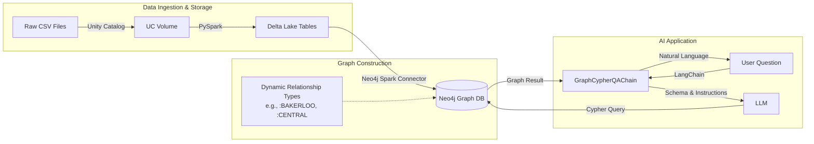

# From Raw Data to Intelligent Knowledge Graphs with Natural Language Queries

## Introduction

The journey from raw data to an intelligent, conversational knowledge graph represents a shift from rigid, pre-defined dashboards to flexible, natural language interrogation. This post details the engineering implementation of a system that combines the **Databricks Lakehouse** architecture with **Neo4j's** graph capabilities.

We culminate in a text-to-Cypher interface powered by **LangChain** and Large Language Models (LLMs). Using London's public transport network as our dataset, we will examine the code required to transform CSV files into a sophisticated knowledge graph. We will then build a reliable agent capable of answering questions like "Find the shortest path between King's Cross and Victoria."

## Architecture Overview

The pipeline follows a rigorous data engineering flow: data ingestion via Databricks, graph construction via the Neo4j Spark Connector, and query processing via a LangChain agent.



## Stage One: The Foundation - Databricks Lakehouse & Unity Catalog

Before we can build a high-quality graph, we need a robust data foundation. We utilize the **Databricks Lakehouse** architecture, which unifies the massive scale of data lakes with the data management features of data warehouses.

### Unity Catalog: Governed Data Management
Central to this architecture is **Unity Catalog**. In our implementation, we use Unity Catalog Volumes to handle our raw file ingestion. This abstracts the underlying cloud storage (like S3 or ADLS), providing a unified, governed namespace for our files (`/Volumes/catalog/schema/volume/file.csv`).

This governance layer is critical for enterprise security. It ensures that access to raw data is audited and controlled before any processing begins.

### Delta Lake: The Reliability Layer
In our pipeline, we don't just read files and write to the graph. We ingest raw CSVs into **Delta Lake** tables first. Delta Lake adds a layer of reliability to standard Parquet files.

It brings **ACID transactions** to Spark. This ensures that our data operations are atomic and consistent. If a write fails midway, we don't end up with corrupted or partial data.

It also provides **Schema Enforcement**. We define our schema explicitly in PySpark, which ensures coordinates are doubles and IDs are integers. Any bad data is rejected at this stage, preventing "garbage in" from reaching the graph.

```python
# From notebooks/load_london_transport.ipynb
# Validating and writing stations to a managed Delta table
stations_clean = (
    stations_df
    .select(
        F.col("ID").cast("integer").alias("station_id"),
        F.col("Station_Name").alias("name"),
        # ... types are enforced here
    )
)
# Writing to Delta ensures ACID guarantees and persistence
stations_clean.write.format("delta").mode("overwrite").saveAsTable(STATIONS_TABLE)
```

## Stage Two: High-Scale Ingestion with the Neo4j Spark Connector

Moving data from a relational/tabular format (Spark DataFrames) to a graph structure (Nodes and Relationships) requires efficient translation. We use the **Neo4j Spark Connector**, a specialized library designed for high-throughput data movement.

### Distributed Processing Architecture
The connector leverages the distributed nature of Apache Spark. When a write operation is triggered, the Spark driver does not handle the data. Instead, the DataFrame is partitioned across the cluster's executors.

Each executor establishes its own batch of connections to the Neo4j database using the **Bolt** binary protocol. This allows for massive parallelism. We can load millions of nodes and relationships simultaneously, limited only by the size of the Spark cluster and the Neo4j instance's write capacity.

### Dynamic Graph Modeling: Data as Schema
A critical design choice in this project is how we model transit lines. We avoid generic modeling. Instead of a single `:CONNECTED_TO` relationship with a property `{line: "Bakerloo"}`, we create specific relationship types for each line, such as `:BAKERLOO` or `:VICTORIA`.

**Performance Implications:**
Neo4j uses **native pointer chasing** (index-free adjacency) for traversal, but it indexes relationship types. Querying `MATCH ()-[:BAKERLOO]-()` allows the engine to instantly isolate only the relevant pointers.

Scanning a generic relationship type and filtering on a string property would require reading every single connection and checking its properties—a much slower operation O(n) vs O(1) lookups.

### The Code Implementation
We achieve this dynamically in PySpark. We loop through the distinct lines in our data, defining the relationship type variable (`rel_type`) on the fly.

Crucially, we use the `.option("relationship.save.strategy", "keys")` configuration. This tells the connector to perform a **MERGE** operation based on the node keys (station names).

If we used the default `Create` strategy, re-running the pipeline would duplicate every connection. The `keys` strategy ensures **idempotency**. This means the pipeline generates the exact same graph state regardless of how many times it runs.

```python
# From notebooks/load_london_transport.ipynb
# Writing dynamic relationship types (e.g., :BAKERLOO)
(
    line_data.write
    .format("org.neo4j.spark.DataSource")
    .mode("Append")
    .option("relationship", rel_type)             # Dynamic Type: BAKERLOO
    
    # Idempotent Merge Strategy:
    # Matches existing nodes instead of creating new ones.
    .option("relationship.save.strategy", "keys") 
    
    # Schema Mapping:
    # Maps DataFrame columns to Node Properties for lookup
    .option("relationship.source.labels", ":Station")
    .option("relationship.source.node.keys", "from_station:name")
    .option("relationship.target.labels", ":Station")
    .option("relationship.target.node.keys", "to_station:name")
    .save()
)
```

## Stage Three: The Natural Language Agent

With the graph built, we create an agent to query it. We use **LangChain's** `GraphCypherQAChain`. This component orchestrates a complex flow of operations to bridge the gap between natural language and database query languages.

### The Agent Workflow
1.  **Schema Retrieval:** The agent first connects to Neo4j to fetch the current schema (node labels, relationship types, and property keys).
2.  **Prompt Construction:** It combines the user's question with the schema and our specific instructions into a prompt.
3.  **Cypher Generation:** The LLM (Claude Sonnet or GPT-4) generates a Cypher query.
4.  **Execution:** The generated query is executed against the Neo4j database.
5.  **Response Synthesis:** The raw database results are sent back to the LLM to generate a natural language answer.

### Prompt Engineering for Reliability
The biggest challenge with Text-to-Cypher is **hallucination**—the LLM generating invalid syntax or assuming schema elements that don't exist.

To combat this, we don't just rely on the LLM's inherent knowledge. We provide a strict `PromptTemplate` that enforces rules specific to our graph structure.

In our `agents/query_neo4j.py`, we explicitly instruct the model on:
1.  **Case Insensitivity:** Users write "kings cross", database has "King's Cross". We force `toLower()` comparisons to ensure matches.
2.  **Modern Syntax:** We enforce the use of `COUNT{}` subqueries (Neo4j 5.x syntax) for better performance and cleaner code.
3.  **Schema Awareness:** We remind the model that tube lines are *relationship types*, not properties, preventing queries like `MATCH ()-[r {type:'Bakerloo'}]-()`.

```python
# From agents/query_neo4j.py
cypher_template = """Task: Generate Cypher statement to query the London Transport Network...
Instructions:
- Use only the provided relationship types...
- Use `WHERE toLower(node.name) CONTAINS toLower('name')`...
- For counting patterns, use modern COUNT{{}} subquery syntax...
"""
```

## Conclusion

By combining **Databricks** for robust data engineering, the **Neo4j Spark Connector** for efficient graph construction, and **LangChain** for accessible user interfaces, we can build knowledge graph applications that are both performant and easy to use.

The shift from "Code" to "Natural Language" doesn't eliminate the need for engineering; it shifts the focus. The engineering effort moves to:
1.  **Data Quality:** Ensuring the graph contains clean, valid data (Delta Lake).
2.  **Graph Modeling:** Designing schemas that are performant and semantically clear (Dynamic Relationship Types).
3.  **Prompt Engineering:** Creating constraints that guide the LLM to write correct database queries.