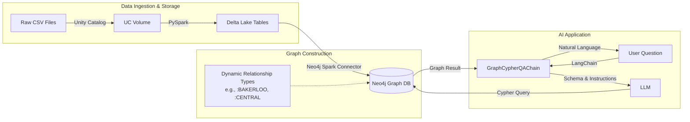

# From Raw Data to Intelligent Knowledge Graphs with Natural Language Queries

## Introduction

The journey from raw data to an intelligent, conversational knowledge graph represents a shift from rigid, pre-defined dashboards to flexible, natural language interrogation. This post details the engineering implementation of a system that combines the **Databricks Lakehouse** architecture with **Neo4j's** graph capabilities, culminating in a text-to-Cypher interface powered by **LangChain** and Large Language Models (LLMs).

Using London's public transport network as our dataset, we will examine the code required to transform CSV files into a sophisticated knowledge graph and build a reliable agent capable of answering questions like "Find the shortest path between King's Cross and Victoria."

## Architecture Overview

The pipeline follows a linear flow: data ingestion via Databricks, graph construction via the Neo4j Spark Connector, and query processing via a LangChain agent.



### The Tech Stack
*   **Databricks Unity Catalog:** Governed storage for raw CSVs and Delta Lake tables.
*   **PySpark & Delta Lake:** Data validation, cleaning, and transformation.
*   **Neo4j Spark Connector:** High-performance, parallelized bulk loading into the graph.
*   **LangChain & Neo4j GraphCypherQAChain:** The framework orchestration for the natural language agent.

## Stage One: Ingestion and Validation (Spark/Delta)

Before reaching the graph, data must be validated. We land raw CSV files into Databricks Unity Catalog Volumes and process them into **Delta Lake** tables. This intermediate step is crucial for production systems; it allows us to enforce schemas and check data quality (e.g., ensuring coordinates are valid doubles, ensuring station IDs are unique) using standard SQL or PySpark before the data ever touches the graph.

```python
# From notebooks/load_london_transport.ipynb
# Example: validating and writing stations to Delta Lake
stations_clean = (
    stations_df
    .select(
        F.col("ID").cast("integer").alias("station_id"),
        F.col("Station_Name").alias("name"),
        F.col("Latitude").cast("double").alias("latitude"),
        F.col("Longitude").cast("double").alias("longitude"),
        ...
    )
)
stations_clean.write.format("delta").mode("overwrite").saveAsTable(STATIONS_TABLE)
```

## Stage Two: Graph Construction with Neo4j Spark Connector

The core of our ETL pipeline is the **Neo4j Spark Connector**. Unlike generic database drivers, this connector is optimized for Spark's distributed architecture. It partitions DataFrames and writes to Neo4j in parallel batches, making it capable of handling massive datasets efficiently.

### Dynamic Graph Modeling: Data as Schema

A critical design choice in this project is how we model transit lines. Instead of a generic `:CONNECTED_TO` relationship with a property `{line: "Bakerloo"}`, we create specific relationship types for each line, such as `:BAKERLOO` or `:VICTORIA`.

**Why?**
1.  **Performance:** Neo4j indexes relationship types. Querying `MATCH ()-[:BAKERLOO]-()` is significantly faster than scanning relationships and filtering properties.
2.  **Semantics:** The graph schema itself describes the network topology.

We achieve this dynamically in PySpark by iterating through the distinct lines found in our data and configuring the Spark Connector to write specific relationship types on the fly.

### The Code Implementation

Here is the actual loop from our ETL notebook. Note the use of `relationship.save.strategy` set to `keys`. This ensures **idempotency**; if we re-run the job, the connector matches existing relationships based on the node keys rather than creating duplicates.

```python
# From notebooks/load_london_transport.ipynb

# 1. Iterate through every distinct tube line in the dataset
for line in sorted(tube_lines_list):
    
    # 2. Transform data value (e.g., "District Line") into a Schema Type (e.g., "DISTRICT_LINE")
    rel_type = line.upper().replace(" ", "_").replace("&", "AND")
    
    # 3. Filter the DataFrame for just this line
    line_data = tube_lines.filter(F.col("Tube_Line") == line)
    
    # 4. Write to Neo4j using the Spark Connector
    (
        line_data.write
        .format("org.neo4j.spark.DataSource")
        .mode("Append")
        # Map the dynamic relationship type
        .option("relationship", rel_type)
        
        # MERGE strategy: find existing nodes, don't create duplicates
        .option("relationship.save.strategy", "keys")
        
        # Define Source Node lookup (find Station by name)
        .option("relationship.source.labels", ":Station")
        .option("relationship.source.save.mode", "Match")
        .option("relationship.source.node.keys", "from_station:name")
        
        # Define Target Node lookup
        .option("relationship.target.labels", ":Station")
        .option("relationship.target.save.mode", "Match")
        .option("relationship.target.node.keys", "to_station:name")
        
        .save()
    )
```

## Stage Three: The Natural Language Agent

With the graph built, we create an agent to query it. We use **LangChain's** `GraphCypherQAChain`. This component takes a user's natural language question, uses an LLM to translate it into a Cypher query, executes that query against Neo4j, and uses the LLM again to summarize the results.

### Prompt Engineering for Reliability

The biggest challenge with Text-to-Cypher is **hallucination**—the LLM generating invalid syntax or assuming schema elements that don't exist. To combat this, we don't just rely on the LLM's training; we provide a strict `PromptTemplate` that enforces rules specific to our graph structure.

In our `agents/query_neo4j.py`, we explicitly instruct the model on:
1.  **Case Insensitivity:** Users write "kings cross", database has "King's Cross". We force `toLower()` comparisons.
2.  **Modern Syntax:** We enforce the use of `COUNT{}` subqueries (Neo4j 5.x syntax) for better performance and cleaner code.
3.  **Schema Awareness:** We remind the model that tube lines are *relationship types*, not properties.

```python
# From agents/query_neo4j.py

cypher_template = """Task: Generate Cypher statement to query the London Transport Network graph database.

Instructions:
- Use only the provided relationship types and properties in the schema
- Do not use any other relationship types or properties that are not provided
- Use `WHERE toLower(node.name) CONTAINS toLower('name')` for case-insensitive name matching
- Relationships are bidirectional - you can traverse them in either direction
- For counting patterns, use modern COUNT{{}} subquery syntax
- Each tube line has its own relationship type (e.g., :BAKERLOO, :CENTRAL, :CIRCLE)
- Station properties include: station_id, name, zone, latitude, longitude, postcode

Schema:
{schema}

The question is:
{question}
"""

cypher_prompt = PromptTemplate(
    input_variables=["schema", "question"],
    template=cypher_template
)

# Initialize the Chain with Temperature 0 for deterministic code generation
cypher_chain = GraphCypherQAChain.from_llm(
    graph=graph,
    cypher_llm=ChatOpenAI(temperature=0.0, model="gpt-4"),
    cypher_prompt=cypher_prompt,
    verbose=True
)
```

## Conclusion

By combining **Databricks** for robust data engineering, the **Neo4j Spark Connector** for efficient graph construction, and **LangChain** for accessible user interfaces, we can build knowledge graph applications that are both performant and easy to use.

The shift from "Code" to "Natural Language" doesn't eliminate the need for engineering; it shifts the focus. The engineering effort moves to:
1.  **Data Quality:** Ensuring the graph contains clean, valid data (Delta Lake).
2.  **Graph Modeling:** Designing schemas that are performant and semantically clear (Dynamic Relationship Types).
3.  **Prompt Engineering:** Creating constraints that guide the LLM to write correct database queries.