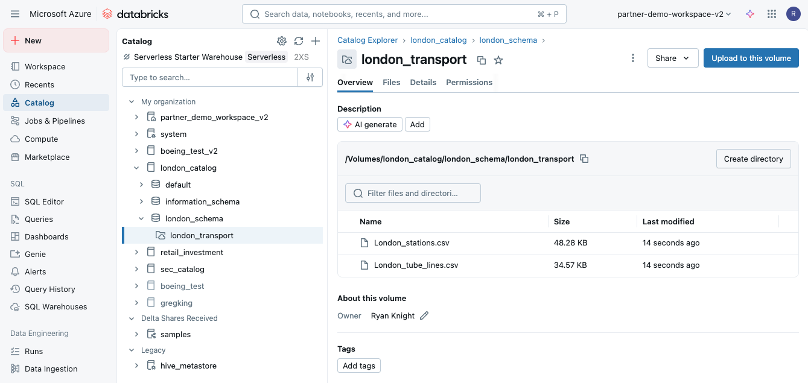
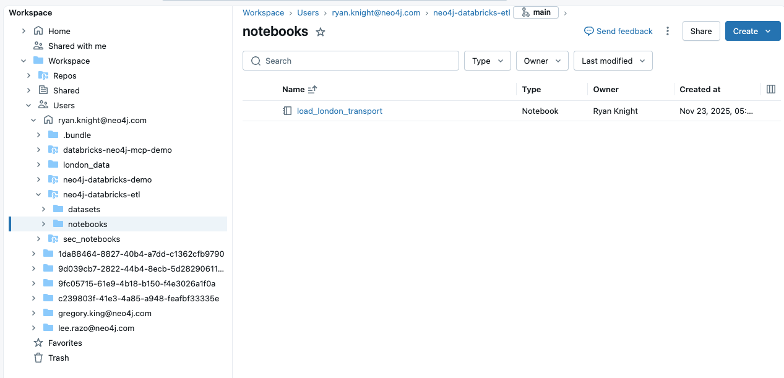

# Databricks to Neo4j ETL Pipeline

Load London Transport Network data from Databricks into Neo4j using Delta Lake and PySpark.

## Overview

This project demonstrates how to ETL data from CSV files in Databricks Unity Catalog into Neo4j graph database using:
- **Delta Lake** for intermediate data storage
- **PySpark** for data transformations
- **Neo4j Spark Connector** for loading graph data

**Dataset:** London Transport Network with 302 stations and tube line connections

## Quick Start

### Prerequisites

1. **Databricks workspace** with Unity Catalog enabled
2. **Neo4j database** 
3. **Neo4j Spark Connector** library installed on cluster:
   - Maven coordinates: `org.neo4j:neo4j-connector-apache-spark_2.12:5.3.1_for_spark_3`
4. **Databricks Secrets** configured:
   ```bash
   # Create secrets scope
   databricks secrets create-scope neo4j

   # Add credentials
   databricks secrets put-secret neo4j password
   ```

### Setup Steps

#### 1. Setup Unity Catalog Volume Using the UI and Upload CSV Files

1. Navigate to **Catalog** in the left sidebar
2. Click the **+** button in the top right
3. Select **Create a catalog**
4. In the dialog:
   - **Catalog name:** `london_catalog`
   - **Type:** Standard
   - **Storage location:** Select default external location and name it `london_catalog`
5. Click **Create**
6. Navigate to the catalog and create a schema:
    - **Schema name:** `london_schema`
    - **Storage location:** Select default external location and name it `london_schema`
7. Navigate to the schema and click **+** > **Create a volume**
    - **Volume name:** `datasets`
    - **Storage location:** Select default external location and name it `datasets`
9. Upload files from `datasets/csv_files/london_transport/` to the volume at `/Volumes/london_catalog/london_schema/london_transport`:
   - `London_stations.csv` (302 stations)
   - `London_tube_lines.csv` (tube line connections)

Your final volume should look like this:




#### 2. Create a Databricks Cluster

1. Navigate to **Compute** in your Databricks workspace
2. Click **Create Compute**
3. Configure the cluster with:
   - **Cluster name**: "Neo4j-London-Transport-Cluster" (or your preferred name)
   - **Cluster mode**: Standard
   - **Access mode**: **Dedicated (formerly: Single user)** - ⚠️ **REQUIRED** for Neo4j Spark Connector
   - **Databricks Runtime**: 13.3 LTS or higher (Spark 3.x)
   - **Node type**: Standard_DS3_v2 (14 GB Memory, 4 Cores)
   - **Workers**: Enable "Single node" (sufficient for this demo with 302 stations)
4. Click **Create**

**Install required libraries:**

After the cluster is created, install the following libraries:

**Maven Library** (Neo4j Spark Connector):
- Click on your cluster → **Libraries** tab
- Click **Install New** → Select **Maven**
- Enter coordinates: `org.neo4j:neo4j-connector-apache-spark_2.12:5.3.1_for_spark_3`
- Click **Install** and wait for status: "Installed"

**PyPI Library** (Neo4j Python Driver):
- Click **Install New** → Select **PyPI**
- Enter package name: `neo4j==6.0.2`
- Click **Install** and wait for status: "Installed"

**Important Notes:**
- ⚠️ The Neo4j Spark Connector does **NOT** work in Shared access mode
- Restart the cluster if needed to ensure libraries are loaded


#### 3. Upload Notebook to Databricks

1. In Databricks, navigate to **Workspace** in the left sidebar
2. Navigate to **Users** > **your.email@domain.com** (your username)
3. Create a new folder (e.g., `neo4j-databricks-etl`)
4. Inside that folder, create a `notebooks` subfolder
5. Upload `notebooks/load_london_transport.ipynb` to this location

Your workspace structure should look like this:



**Note:** Your workspace may look different depending on other folders you've created.

#### 4. Configure Notebook

Open the uploaded notebook and update the widgets with your values:

```python
# Neo4j connection
NEO4J_URL = "bolt://localhost:7687"  # Your Neo4j URL
NEO4J_DB  = "neo4j"                   # Your database name

# Unity Catalog paths
BASE_PATH = "/Volumes/london_catalog/london_schema/london_transport"
CATALOG = "london_catalog"
SCHEMA = "london_schema"
```

#### 5. Run Notebook

Execute all cells in order:
1. Configure connection
2. Test Neo4j connectivity
3. Load CSVs to Delta Lake
4. Write Station nodes to Neo4j
5. Create tube line relationships
6. Validate results

### Expected Results

After successful execution:
- **302 Station nodes** in Neo4j with properties: name, zone, postcode, coordinates
- **All tube line relationships** connecting stations bidirectionally (Bakerloo, Central, Circle, District, etc.)
- **Dynamic relationship types** for each tube line (e.g., :BAKERLOO, :CENTRAL, :CIRCLE)
- **Delta Lake tables** for stations and tube lines

## Project Structure

```
neo4j-databricks-etl/
├── README.md                              # This file
├── DBX_PORT_v2.md                         # Implementation plan and status
├── datasets/
│   ├── csv_files/
│   │   └── london_transport/
│   │       ├── London_stations.csv        # 302 stations
│   │       └── London_tube_lines.csv      # Tube connections
│   └── README.md                          # Dataset documentation
└── notebooks/
    └── load_london_transport.ipynb        # Main ETL notebook
```

## Implementation Details

### Data Flow

```
CSV files → Unity Catalog Volume → Delta Lake tables → PySpark → Neo4j
```

### Delta Lake Tables

**Stations Table:**
- Columns: station_id, name, latitude, longitude, zone, postcode
- Row count: 302

**Tube Lines Table:**
- Columns: Tube_Line, From_Station, To_Station
- Row count: ~300 connections

### Neo4j Graph Model

**Nodes:**
- `(:Station)` with properties: station_id, name, latitude, longitude, zone, postcode

**Relationships:**
- Dynamic relationship types for each tube line (bidirectional)
- Examples: `:BAKERLOO`, `:CENTRAL`, `:CIRCLE`, `:DISTRICT`, `:HAMMERSMITH_AND_CITY`, `:JUBILEE`, `:METROPOLITAN`, `:NORTHERN`, `:PICCADILLY`, `:VICTORIA`, `:WATERLOO_AND_CITY`
- Format: `(:Station)-[:TUBE_LINE]->(:Station)`

### Key Features

- **Intermediate Delta Lake storage** for data validation
- **Type-safe transformations** using PySpark
- **Dynamic relationship types** - automatically creates relationship types for each tube line
- **Batch relationship creation** using custom Cypher
- **Comprehensive validation queries**
- **Index creation** for performance

## Validation Queries

Run these in Neo4j Browser:

```cypher
// Count all stations
MATCH (s:Station)
RETURN count(s) as total_stations;

// Count all relationships by type
MATCH ()-[r]->()
RETURN type(r) as line, count(r) as connections
ORDER BY connections DESC;

// Find stations with most connections (across all lines)
MATCH (s:Station)-[r]-()
RETURN s.name, count(r) as total_connections
ORDER BY total_connections DESC
LIMIT 10;

// Sample multi-line path query (e.g., Baker Street connections)
MATCH (s:Station {name: 'Baker Street'})-[r]-(connected:Station)
RETURN s.name, type(r) as tube_line, connected.name
LIMIT 20;

// Find paths between two stations across any lines
MATCH path = shortestPath(
  (from:Station {name: 'King\'s Cross St. Pancras'})-[*..5]-(to:Station {name: 'Victoria'})
)
RETURN path
LIMIT 1;
```

## Troubleshooting

### Connection Issues

**Error:** `Connection refused`
- Verify Neo4j is running
- Check firewall allows port 7687
- Confirm URL format: `bolt://host:7687` or `neo4j+s://instance.databases.neo4j.io:7687`

**Error:** `Authentication failed`
- Verify Databricks Secrets are configured correctly
- Check username/password in Databricks Secrets scope

### File Issues

**Error:** `File not found`
- Verify Unity Catalog volume path: `/Volumes/catalog/schema/volume`
- Confirm CSV files are uploaded to volume
- Check file permissions

### Data Issues

**Error:** `Relationship creation failed`
- Ensure Station nodes exist before creating relationships
- Verify station names match exactly between CSVs
- Check for trailing spaces or case mismatches

## Performance Tips

1. **Batch relationship creation** - Process in chunks for large datasets
2. **Create indexes first** - Before loading relationships
3. **Use Delta Lake caching** - Cache tables used multiple times
4. **Monitor Spark UI** - Check for data skew or memory issues

## Reference

This implementation follows patterns from the [databricks-neo4j-mcp-demo](https://github.com/neo4j-partners/databricks-neo4j-mcp-demo) project.

### Key Differences from GCP Dataflow

| Aspect | GCP Dataflow | This Project |
|--------|--------------|--------------|
| Configuration | JSON templates | Notebook cells |
| Data Source | BigQuery | Delta Lake |
| Orchestration | Managed template | Direct PySpark |
| Monitoring | Dataflow console | Spark UI |

## License

Sample data from Transport for London. Educational purposes only.

---

**Built with:** Databricks | Delta Lake | PySpark | Neo4j Spark Connector
